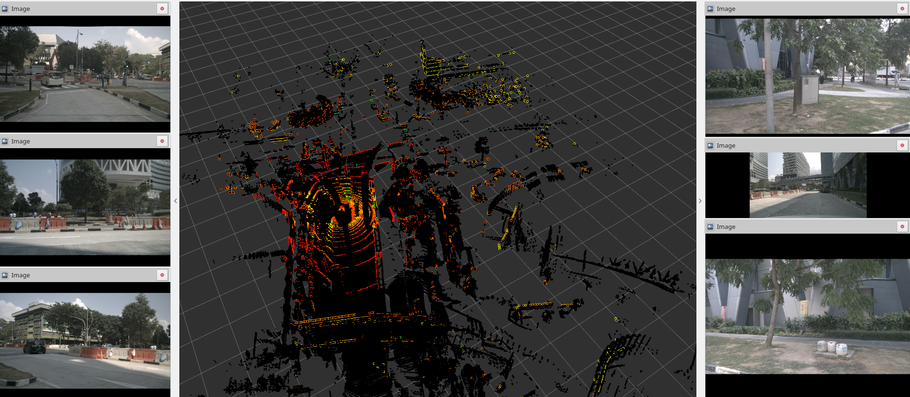

# nuScenes2Bag

Simple C++ tool for converting the [nuScenes](https://www.nuscenes.org/) dataset from [Aptiv](https://www.aptiv.com).

The tool loads the json metadata and then the sample files for each scene. The sample are converted in a suitable ROS msg and written to a bag. TF tree is also written.

Probably the original dataset is also collected by Aptiv using ROS, so most data has the same format.



## Usage

The tool is a normal ROS package. Place it under a workspace and build it with catkin.

You can then use the converter:

```
nuscenes2bag -s aptiv/v1.0_mini/ -o nuscenes_bags -j 2
```

Bag files will be placed under the nuscenes_bags directory. With -j, it is possible to set the number of thread used. 

## Status 

Currently work in progress

- [x] Image support
- [x] Pointcloud support
- [x] Radar support
- [x] EgoPose and TF support
- [x] Show progress
- [ ] Better usability

Create an Github issue for suggestion, bug and requests. 
